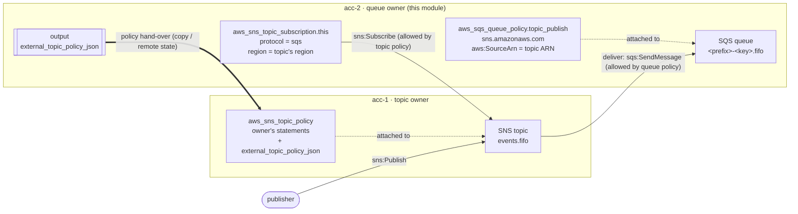
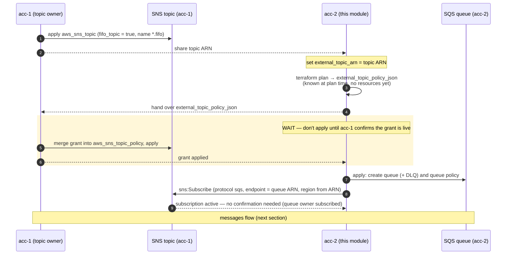
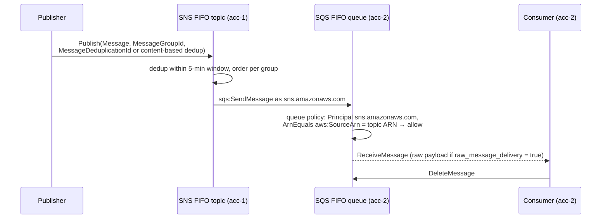

# Cross-account subscriptions

How this module subscribes its queues to an SNS topic owned by **another
AWS account** (and possibly another region). The narrative summary lives
in [ARCHITECTURE.md](ARCHITECTURE.md#external-and-cross-account-topics);
the reasoning behind the design is
[ADR 0005](decisions/0005-cross-account-subscription-by-queue-owner.md).
This page is the step-by-step version.

Throughout, the two parties are:

| Account | Role | Runs |
|---|---|---|
| `acc-1` | **Topic owner** | its own Terraform: a plain `aws_sns_topic` + `aws_sns_topic_policy` |
| `acc-2` | **Queue owner** | this module with `external_topic_arn` set |

The runnable version is [`examples/cross-account/`](../examples/cross-account/):
`acc-1/` (plain `aws_sns_topic`, AWS profile `acc-1`) and `acc-2/` (this
module, profile `acc-2`, one FIFO queue), applied as two separate
configurations.

## Overview



Each side only ever writes its own account's resources. `acc-2` can't edit
`acc-1`'s topic policy, so the module *renders* the statements `acc-1`
needs and `acc-1` merges them in.

## Setup sequence



Notes on the WAIT point:

- If `acc-2` applies before step 3, the queue and queue policy are created
  but `aws_sns_topic_subscription` fails with `AuthorizationError`. That's
  harmless: re-run `apply` once the grant is in.
- The grant only names queues that exist in `acc-2`'s configuration at
  plan time. **Adding, renaming, or toggling `fifo_queue` /
  `subscribe_to_topic` on a queue changes the grant** — hand the new JSON
  over and wait again before applying.
- Turning on `create_topic_tx_role` / `create_topic_tx_policy` also
  changes the grant (adds the `sns:Publish` statement).

## Runtime message flow



FIFO requirements:

- **Both ends must be FIFO.** The topic name ends in `.fifo` (`acc-1`
  sets `fifo_topic = true`); the queue sets `fifo_queue = true`, and
  `modules/sqs` appends `.fifo` to the name. A standard topic can't
  deliver to a FIFO queue.
- **`MessageGroupId` is mandatory** on every publish to a FIFO topic.
  Ordering is per group; it is carried through to the queue.
- **Deduplication**: either the publisher sends `MessageDeduplicationId`,
  or the *topic* has `content_based_deduplication = true`. That's
  `acc-1`'s setting on its own `aws_sns_topic` —
  `topic_content_based_deduplication` in this module only applies to a
  topic this module creates (`create_topic = true`), not to an external
  one.
- `raw_message_delivery` defaults to `true` per queue, so consumers get the
  published body, not the SNS JSON envelope.

## Policy statements on each side

### acc-1: topic policy (rendered by acc-2, applied by acc-1)

Source: `data.aws_iam_policy_document.external_topic_grant` in
[`iam.tf`](../iam.tf), exposed as the `external_topic_policy_json` output.
It is non-null only when `local.external_topic_grant_needed` is true: the
topic's account (parsed from the ARN) differs from the caller's, **and**
there is at least one subscribed queue or a topic tx policy/role.

| Sid | When | Principal | Action | Conditions |
|---|---|---|---|---|
| `AllowSubscribeFrom<acc-2 id>` | ≥1 queue with `subscribe_to_topic = true` | `arn:<partition>:iam::<acc-2>:root` | `sns:Subscribe` on the topic | `StringEquals sns:Protocol = sqs`; `StringEquals sns:Endpoint` = the subscribed queue ARNs |
| `AllowPublishFrom<acc-2 id>` | `create_topic_tx_role` or `create_topic_tx_policy` | `arn:<partition>:iam::<acc-2>:root` | `sns:Publish` on the topic | none |

`acc-1` must **merge** this with its own statements, e.g.:

```hcl
data "aws_iam_policy_document" "topic" {
  source_policy_documents = [var.acc2_grant_json] # acc-2's external_topic_policy_json
  # ... acc-1's own statements ...
}

resource "aws_sns_topic_policy" "this" {
  arn    = aws_sns_topic.this.arn
  policy = data.aws_iam_policy_document.topic.json
}
```

`aws_sns_topic_policy` owns the *whole* policy, so pasting the grant in as
the only document would drop the default owner statements and any other
subscribers' grants.

The account-root principal delegates to IAM in `acc-2` (same idea as
[ADR 0004](decisions/0004-trust-policy-fallback-to-account-root.md)): the
Terraform identity in `acc-2` still needs `sns:Subscribe` in its own IAM
policy, and publishers still need the module's `topic_tx` policy
(`sns:Publish` on the topic ARN, output `topic_tx_policy_arn`).

### acc-2: queue policy (created by this module)

`aws_sqs_queue_policy.topic_publish` in [`main.tf`](../main.tf), one per
subscribed queue:

```json
{
  "Sid": "AllowSNSPublish",
  "Effect": "Allow",
  "Principal": { "Service": "sns.amazonaws.com" },
  "Action": "sqs:SendMessage",
  "Resource": "<queue ARN>",
  "Condition": { "ArnEquals": { "aws:SourceArn": "<external_topic_arn>" } }
}
```

This is identical for same-account and cross-account topics — the
`aws:SourceArn` check works across accounts and regions. Note that it
replaces any other queue policy on that queue.

## Why the queue ARNs are predicted

`local.subscribed_queue_arns` (in [`locals.tf`](../locals.tf)) builds each
ARN from the partition, provider region, caller account and the resolved
queue name (adding `.fifo` exactly like `modules/sqs` does), instead of
reading `module.queues[*].arn`. That keeps `external_topic_policy_json`
known at **plan** time, so `acc-1` can apply the grant *before* `acc-2`'s
first apply. Reading the real ARNs would leave the grant unknown until
the queues exist, and the subscription in that same apply would fail.

The catch: if `modules/sqs` naming ever changes, the predicted ARNs stop
matching and Subscribe fails with `AuthorizationError`.

## Cross-region

Everything is derived from the ARN
(`arn:<partition>:sns:<region>:<account>:<name>`, validated in
`variables.tf`):

- `local.topic_region` is passed to the provider-v6 per-resource `region`
  argument on `aws_sns_topic_subscription.this` — the subscription has to
  be created in the topic's region. No provider alias is needed
  (`versions.tf` requires AWS provider `>= 6.28`).
- Queues, queue policies and IAM stay in `acc-2`'s provider region; the
  predicted queue ARNs use that region too.
- The topic may be in a different region from the queue; SNS delivers
  cross-region to SQS.

## Why the queue owner subscribes

AWS supports two directions. If the **topic owner** subscribes a foreign
queue, SNS sends a confirmation message to the queue and the queue owner
must call `ConfirmSubscription` out of band — that can't happen inside a
single `terraform apply`. If the **queue owner** subscribes, SQS endpoints
need no confirmation, and the subscription settings (filter policy, raw
delivery) stay next to the queue definition. The cost is the one hand-over
of the grant. Alternatives, including a second-provider module, are in
[ADR 0005](decisions/0005-cross-account-subscription-by-queue-owner.md).

## Troubleshooting

| Symptom | Likely cause |
|---|---|
| `AuthorizationError` on `aws_sns_topic_subscription` (Subscribe) | `acc-1` hasn't applied the current `external_topic_policy_json` yet, merged an older version (queue added/renamed since), or the queue name/region differs from the predicted ARN. Compare the `sns:Endpoint` values with the real queue ARN. |
| `InvalidParameter` on Subscribe mentioning FIFO | Topic/queue FIFO mismatch: a standard topic with a `fifo_queue = true` queue. The module doesn't validate this; the topic ARN must end in `.fifo`. |
| `external_topic_policy_json` is `null` | Topic is in the same account (no grant needed), or no queue subscribes and no topic tx role/policy is requested. |
| Subscription exists but no messages arrive | Queue policy missing or `aws:SourceArn` doesn't match the topic ARN; a filter policy drops the message; or a customer-managed KMS key on the queue doesn't allow `sns.amazonaws.com` (the AWS-managed `alias/aws/sqs` key never works with SNS). |
| `Publish` rejected for FIFO topic | Missing `MessageGroupId`, or no `MessageDeduplicationId` while the topic has content-based dedup off. |
| `AuthorizationError` on Publish from `acc-2` | Grant applied without the `sns:Publish` statement (re-render after enabling `create_topic_tx_role`/`create_topic_tx_policy`), the publisher lacks the `topic_tx` policy, or the topic uses a CMK whose key policy doesn't allow `acc-2` (`kms:GenerateDataKey*`, `kms:Decrypt`). |
